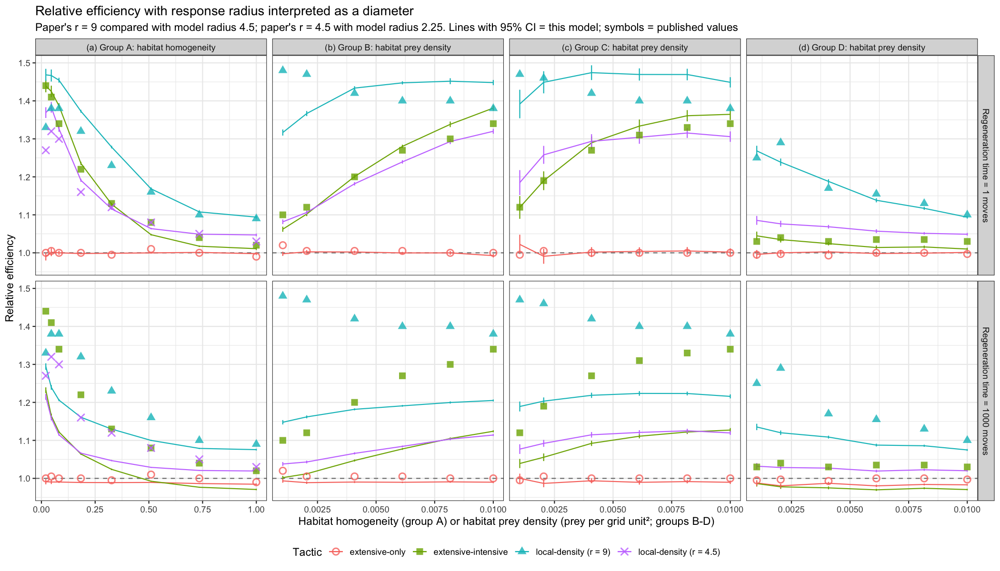

Replication of the simulation model of saltatory search by juvenile plaice described in [Hill et al. (2003)](https://doi.org/10.1111/j.1095-8649.2003.00212.x).

NetLogo 7.0.4

## Contents

- `plaice-search-model.nlogox`: the model. See its Info tab for a description and implementation notes.
- `InputData/`: prey distribution scenarios (Table I) and cumulative distributions of move length and turn angle digitized from Figs 1 and 2.
- `run-experiments.sh`: runs the BehaviorSpace experiments headlessly and writes the output to `Results/`.
- `Analysis/analysis.R`: summarises `Results/` and compares the output with values read by eye from Figs 3 and 4 of the paper (`Analysis/PaperFig3.csv`, `Analysis/PaperFig4.csv`).

## Reproducing the results

```bash
./run-experiments.sh
```

```bash
Rscript Analysis/analysis.R
```

The full design (4 search tactics plus an extra response radius, 26 prey distributions, 2 regeneration times, 60 runs of 1,000,000 moves) takes about 6 hours on 8 cores. The R script needs dplyr, tidyr, readr and ggplot2.

## Results

Output from the full design is in `Results/`, summarised in `Analysis/RandomSampling.csv` and `Analysis/RelativeEfficiency.csv`. Relative efficiency is mean prey captured divided by mean prey captured by random sampling of the same grid. Published values were read by eye from the figures, so treat them as accurate to about ±0.01–0.02 (Fig. 4) or ±500 prey (Fig. 3). The natural prey distributions (Table II, Fig. 5) cannot be replicated because the field maps are not available.


### Prey regeneration

The paper states that a captured prey item was absent for 1000 predator moves. With that value the model does not reproduce the published random-sampling results (Fig. 3). Captures are on average 35% lower than published, e.g., ~19,000 vs ~31,000 per million moves for 49 prey in the homogeneous habitat. The published values are matched closely (mean difference +2.5%) when prey are not depleted (`regeneration-time` = 1). For 49 prey in a 70 x 70 habitat, 31,000 captures per million moves is almost exactly the no-depletion expectation (49π/4900 ≈ 0.0314 per move).

Fig. 4 points the same way. With a regeneration time of 1000, the extensive–intensive tactic is *less* efficient than random sampling in homogeneous habitats (0.97–0.99 in group D). The paper reports that it is 3–4% *more* efficient. With a regeneration time of 1 it is 1.01–1.05. Shorter regeneration times (10–250 moves) gave no better fit in exploratory runs. **The published results therefore appear to have been produced with little or no prey depletion, despite the stated 1000-move regeneration time.** Both values are included in the experiments.

### Root mean square difference from published relative efficiency

| Tactic | Regeneration = 1 | Regeneration = 1000 |
|---|---|---|
| extensive-only | 0.009 | 0.013 |
| extensive-intensive | 0.023 | 0.148 |
| local-density (r = 9) | 0.091 | 0.160 |
| local-density (r = 4.5) (group A only) | 0.146 | 0.049 |

### Summary

With no prey depletion, the replication reproduces:

- the random-sampling results (Fig. 3);
- extensive-only search being as efficient as random sampling everywhere;
- the extensive–intensive tactic's efficiency in all four groups, closely (e.g., 1.44 vs 1.44 in the most heterogeneous habitat; increasing with prey abundance in groups B and C);
- the local-density tactic (r = 9) being the most efficient tactic in groups B and C, and declining with homogeneity in group A.

It does not reproduce:

- **Local density in small patches (group A).** The paper has local density (r = 9) peaking at intermediate homogeneity and being beaten by extensive–intensive in the most heterogeneous habitat. The model has it highest in the smallest patch (1.52 vs 1.33). Group C local density is also 0.05–0.11 too high.
- **Local density at r = 4.5.** In the paper it is clearly less efficient than r = 9 in heterogeneous habitats. In the model the two radii are nearly identical in group A without depletion.
- **Local density (r = 9) in group D with 20 or more prey.** The model gives ~1.00 vs 1.10–1.17 published. With prey spacing of 7–10 grid units, the circle of radius 9 rarely holds more prey than the threshold (1.0–2.5 prey), so the predator almost never switches to intensive search.

These remaining differences all involve the local-density rule, which the paper does not fully specify.

### Local-density rule

Several alternative readings of the rule were tested (8 runs of each scenario, regeneration time = 1):

| Variant | Effect on fit to published values |
|---|---|
| Density measured at the pause before the previous one (one-move lag) | Much worse (e.g., 1.69 vs 1.33 in the smallest patch) |
| Density counted before rather than after a capture | No change |
| Density counted from the lattice point nearest the predator | No change |
| Threshold averaged over all habitat positions (circles truncated at edges) | Improves one scenario (20 prey, group D) only |
| Threshold rounded down to an integer; intensive if count ≥ threshold | Worse |
| Threshold rounded to the nearest integer | Worse |

The one reading that substantially improves the fit is that **the published response radii (9 and 4.5 grid units) are circle diameters**. That is, the paper's "r = 9" corresponds to a radius of 4.5 and its "r = 4.5" to a radius of 2.25. The full design was run with radius 2.25 (experiment `local-density-r2.25`); radius 4.5 was already in the `local-density` experiment. Root mean square difference from published values with regeneration time = 1 (`Analysis/LocalDensityFit.csv`):

| Published tactic | Group | As radius | As diameter |
|---|---|---|---|
| local-density (r = 9) | A | 0.093 | 0.069 |
| local-density (r = 9) | B | **0.046** | 0.089 |
| local-density (r = 9) | C | 0.092 | 0.063 |
| local-density (r = 9) | D | 0.116 | **0.025** |
| local-density (r = 4.5) | A | 0.146 | **0.045** |
| All local-density | | 0.106 | **0.061** |



Under the diameter interpretation:

- **Group D** is reproduced (1.27, 1.24, 1.19, 1.14, 1.12, 1.09 vs published 1.25, 1.29, 1.17, 1.16, 1.13, 1.10). With a radius of 9, the threshold exceeds one prey for 20 or more prey, and efficiency collapses to ~1.00. With a radius of 4.5 it stays below one prey.
- **The two response radii are ordered as in the paper.** The smaller one is clearly less efficient in heterogeneous habitats (group A). With the stated radii the two were nearly identical.

It does not explain:

- **The most heterogeneous habitats (group A, smallest patches).** The paper's local density (r = 9) is ~0.1 lower than the model and less efficient than extensive–intensive.
- **Group B with few prey.** The fit gets worse (1.32 vs 1.48 published at 5 prey), and efficiency increases with prey abundance where the paper's decreases.

The paper explicitly says "radius", so this is a plausible explanation rather than a confirmed one. For the smallest patches, the paper attributes the lower efficiency to intensive search starting before the predator reaches the patch. The model shows this effect, but more weakly than the paper.
